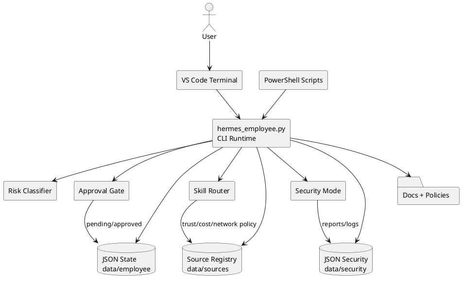
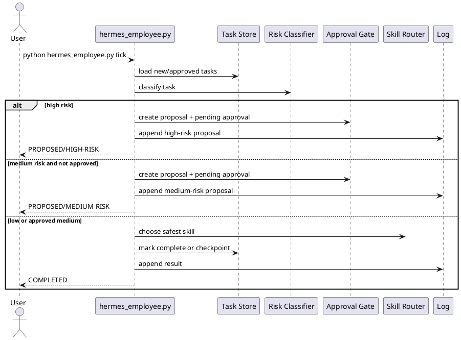
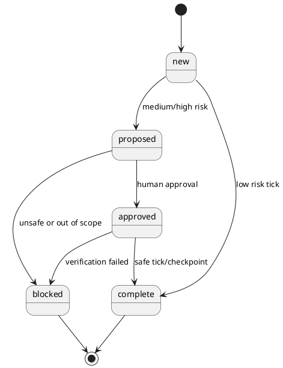

# SPEC-001-MIA Local Operator Runtime

## Background

The uploaded package already establishes a strong local-first foundation:

- `hermes_employee.py` is a deterministic Python CLI using only the standard library.
- State is stored in JSON under `data/employee`, `data/security`, and `data/sources`.
- The tick loop classifies tasks, routes them through skills, creates approval gates for medium/high risk work, logs decisions, and refuses unsafe security requests.
- PowerShell scripts support local installation and foreground/scheduled execution.
- Existing docs define character, employee rights, source trust, security boundaries, and ethical hacking mode.

This polish turns the concept from “GODMODE” branding into a contractor-buildable local operator system: precise, measurable, auditable, and safe. The word “weapon” is treated only as a metaphor for sharpness, focus, and usefulness. The system must never become malware, spyware, phishing tooling, credential theft tooling, evasion tooling, or an unauthorised hacking agent.

## Requirements

### Must Have

- Local-only operation by default: no cloud, no paid APIs, no Copilot dependency, no hidden network calls.
- Deterministic foreground CLI commands for status, add, tick, approve, complete, route, source-plan, security-check, secret-scan, threat-model, and harden-plan.
- JSON state stores for tasks, approvals, heartbeat, scoreboards, bonus ledger, sources, and logs.
- Approval gates for medium-risk actions and explicit refusal for unsafe/offensive security actions.
- Append-only operator and security logs.
- Secret scanning that masks findings and does not edit/delete files.
- Human-readable docs and runbooks sufficient for a contractor to install, validate, operate, and extend the system.
- Risk policy and source trust policy stored as versioned JSON.
- Acceptance tests for install safety, schema validity, CLI command presence, and baseline security posture.

### Should Have

- Stronger schemas for every JSON store.
- Safer installer with dry-run mode, path parameter, backup creation, and no destructive defaults.
- Contractor backlog split into milestones with acceptance criteria.
- ADRs for local-first runtime, JSON state, approval gates, and no-network default.
- PlantUML diagrams for component architecture, tick sequence, and task state transitions.
- A repeatable smoke-test script that does not call network services.

### Could Have

- Optional SQLite persistence later if JSON stores become too hard to audit.
- Optional pytest suite later; MVP remains standard-library only.
- Optional plugin folder for new skills with signed/approved manifests.
- Optional local dashboard reading JSON state only.

### Won't Have for MVP

- Autonomous network access.
- Browser automation.
- Credential handling beyond detecting accidental secrets.
- Cloud scheduling.
- Payment/spending actions.
- Stealth, persistence, exploitation of third-party systems, or evasion behavior.

## Method

### Core Concept

MIA is a local operator runtime. It does not “act like a human on the internet.” It turns messy objectives into safe local checkpoints. Each tick is visible, logged, reversible, and approval-gated.

Operating rule:

```text
compress → classify → risk_check → source_plan → route → act_or_propose → verify → log → checkpoint
```

### System Components



### Tick Sequence



### Task State Machine



### Data Model

The MVP uses JSON files as durable stores. Each file must remain small, human-readable, and version-controlled unless it contains secrets.

#### `data/employee/tasks.json`

```json
[
  {
    "id": "T-YYYYMMDD-HHMMSS",
    "text": "Inspect Hermes and propose next safe build step",
    "status": "new|proposed|approved|working|blocked|complete",
    "priority": 1,
    "risk": "low|medium|high",
    "created_at": "ISO-8601",
    "updated_at": "ISO-8601",
    "proposal": "",
    "result": ""
  }
]
```

#### `data/employee/approvals.json`

```json
[
  {
    "task_id": "T-YYYYMMDD-HHMMSS",
    "created_at": "ISO-8601",
    "risk": "medium|high",
    "reason": "Approval reason",
    "status": "pending|approved|rejected",
    "approved_at": "ISO-8601 or omitted"
  }
]
```

#### `data/sources/source_registry.json`

Each source has a trust score, cost, network flag, approval flag, and allowed flag. Local repo and local data are first-class trusted sources. AI-generated data is hypothesis only.

### Algorithms

#### Risk Classifier

```text
input: task text
lowercase task
if text contains high-risk keyword:
    return high
if text contains medium-risk keyword:
    return medium
return low
```

Refinement required: keywords must be moved into `policies/risk_policy.json` so contractors can tune behavior without editing runtime code.

#### Approval Gate

```text
if risk == high:
    create proposal
    create approval request
    do not execute
elif risk == medium and task is not approved:
    create proposal
    create approval request
    do not execute
else:
    route to safest local skill
```

#### Safe Source Planning

```text
prefer local repo, local data, and direct user input
require approval for network sources
rank by trust score
if sources conflict, lower confidence and log conflict
never treat AI-generated content as authoritative
```

#### Security Mode

Allowed security work:

- owned/local audits
- defensive threat models
- secret scanning
- repo hardening
- dependency review planning
- CTF/lab learning with toy examples only

Refused security work:

- credential theft
- phishing
- malware
- ransomware
- persistence
- evasion
- stealth
- exfiltration
- unauthorised scanning
- attacking third-party systems
- hiding tracks

### Existing Application Patterns Used

- Taskwarrior-style local task queue: simple visible state, terminal-first operation.
- cron/GitHub-Actions-style scheduled checks: repeatable command execution, but local-only for MVP.
- pre-commit-style safety gate: checks before committing or pushing.
- Dependabot-style dependency review concept: reports and proposals, not silent changes.
- ADR-style architecture decisions: every important constraint has a documented reason.

## Implementation

### Phase 1: Lock the Safe Core

1. Keep `hermes_employee.py` standard-library only.
2. Add `policies/risk_policy.json`, `policies/approval_policy.json`, and `policies/source_trust_policy.json`.
3. Add JSON schemas for tasks, approvals, events, skills, sources, and scoreboards.
4. Add `scripts/validate_mia_package.py` to validate JSON, required files, command names, and policy presence.
5. Add a safer PowerShell overlay installer with `-DryRun`, `-Repo`, and backup behavior.

### Phase 2: Productize the Operator

1. Add a contractor runbook with exact commands.
2. Add acceptance criteria for each CLI command.
3. Add a milestone backlog with owners and test evidence.
4. Add ADRs for local-first runtime, JSON state, no-network default, and approval gates.
5. Add a QA checklist for every commit.

### Phase 3: Strengthen the Runtime

1. Move risk keywords from Python constants to policy JSON.
2. Add event log JSONL in addition to markdown logs.
3. Add command result objects for every CLI command.
4. Add `validate-state` CLI command.
5. Add `doctor` CLI command to check repo shape, Python version, required files, and JSON validity.
6. Add `explain-task <id>` CLI command to show why risk/route decisions were made.

### Phase 4: Optional Local Dashboard

1. Add read-only dashboard that opens local JSON files.
2. No network server by default.
3. If a local server is used, bind only to `127.0.0.1` and require explicit start command.

## Milestones

### M1: Safe Install and Validation

- Safer install script added.
- Validator passes on clean package.
- JSON files parse.
- `hermes_employee.py` compiles.
- No network or cloud requirement introduced.

### M2: Policy Externalization

- Risk, approval, and source trust rules live in JSON policy files.
- Runtime reads policy files.
- Existing CLI behavior remains compatible.

### M3: Operator Readiness

- Runbook complete.
- Acceptance tests documented.
- Contractor backlog complete.
- Smoke-test script added.

### M4: Runtime Explainability

- Each task records risk reason, selected skill, approval reason, and source plan.
- `explain-task` returns a human-readable trace.

### M5: Production-Like Local Operation

- Scheduled task install is explicit and reversible.
- Secret scan runs before commit.
- Security-check evidence is stored under `data/security`.

## Gathering Results

### Success Metrics

- 100% local operation for MVP commands.
- Zero hidden network calls.
- Zero unsafe/security-boundary bypasses.
- All JSON files validate.
- All medium/high risk tasks produce proposals instead of silent action.
- Secret scan report is generated before each commit.
- Contractor can install, run smoke tests, add one low-risk task, and produce one approval proposal using only the runbook.

### Review Cadence

- Review logs after every 10 ticks.
- Review policies after every 25 completed tasks.
- Review security score after every repo change.
- Run secret scan before every commit/push.
- Keep safety breaches at zero; any breach freezes feature development until root cause is documented.

## Need Professional Help in Developing Your Architecture?

Please contact me at [sammuti.com](https://sammuti.com) :)
